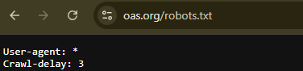
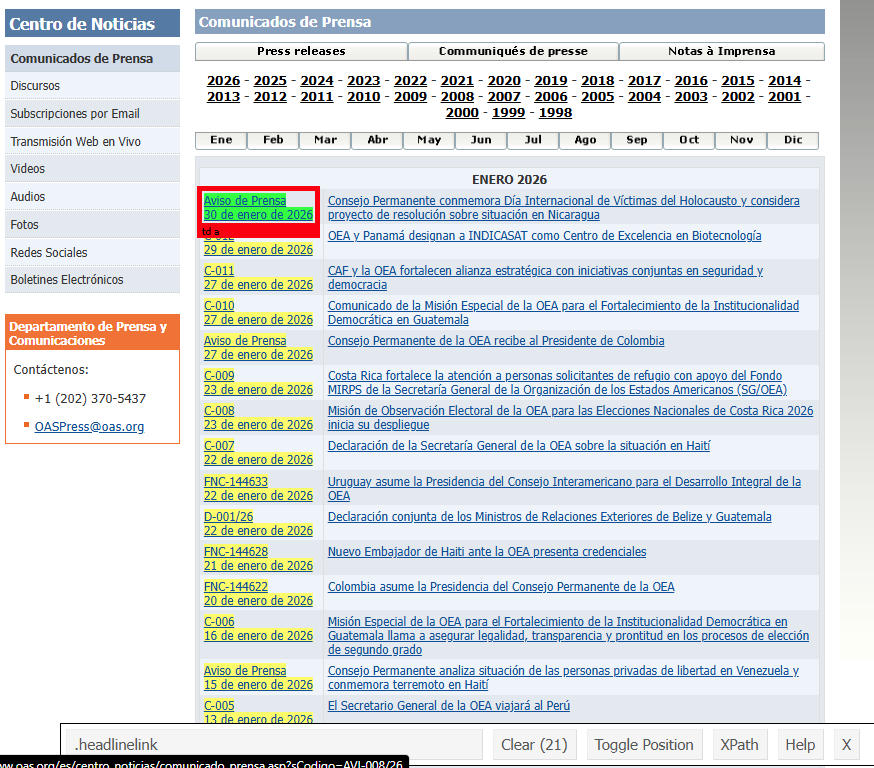
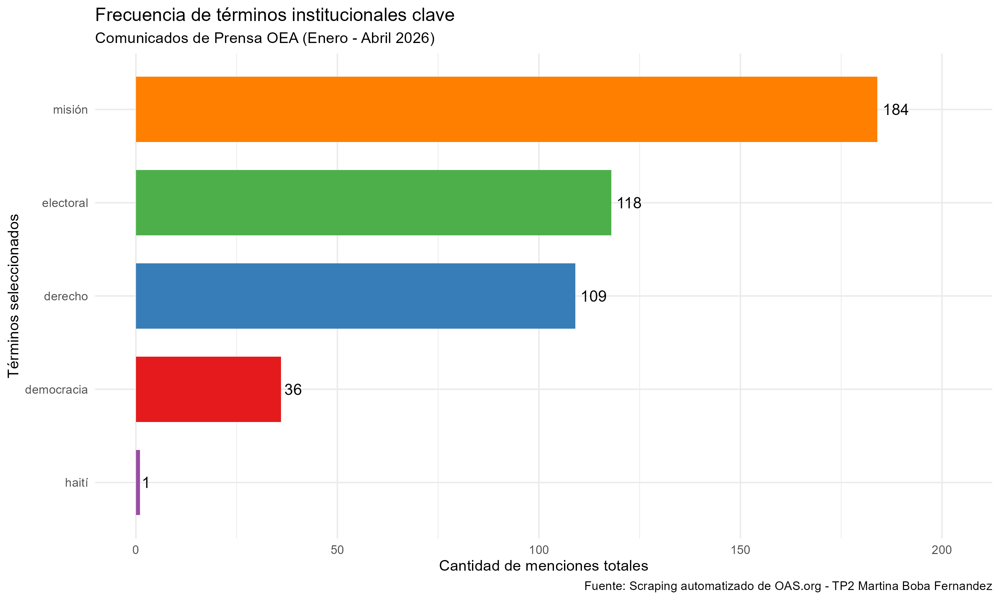

## Trabajo practico N°2

## Introducción e Intención del Análisis

En el ámbito de las Relaciones Internacionales, los comunicados de prensa son herramientas fundamentales para identificar las prioridades políticas y los focos de conflicto en tiempo real.
El objetivo de este trabajo es aplicar técnicas de Web Scraping y Procesamiento de Lenguaje Natural (NLP) para analizar de forma masiva y objetiva la comunicación oficial de la Organización de los Estados Americanos (OEA) entre enero y abril de 2026.

La intención es responder a la siguiente pregunta de investigación:

> **¿Muestra la agenda de la OEA un predominio de conceptos normativos abstractos o está volcada a una dimensión puramente operativa y territorial en el terreno?**

## Metodología y Estructura del Proyecto

El proyecto sigue una estructura modular para garantizar la reproducibilidad.
Se divide en tres etapas fundamentales:

### Recolección de Datos (Web Scraping)

El script `scraping_oea.R` automatiza la descarga de datos.
Para esto, primero consultamos el archivo `robots.txt` de la OEA, detectando un **Crawl-delay de 3 segundos**, el cual respetamos en el código mediante la función `Sys.sleep()`.



Para identificar qué información extraer, utilizamos la herramienta SelectorGadget.
Esta nos permitió "mapear" la estructura HTML de la página e identificar que los links a las noticias estaban bajo el selector CSS `.headlinelink`.



**Lógica del script:**

Itera sobre los meses 1 al 4 del año 2026.

Captura los links de cada comunicado.

Entra a cada noticia y extrae el ID, el Título (etiqueta `h2`) y el Cuerpo (etiquetas `p`).

Guarda los archivos `.html` originales con registro de fecha y una tabla final en formato `.rds`.

### Procesamiento de Texto (NLP)

El script `processing.R` se encarga de convertir el texto bruto en datos analizables:

Limpieza: Se eliminan números, signos de puntuación y caracteres especiales.

Lematización: Usando la librería `udpipe` y el modelo de lenguaje en español, llevamos las palabras a su raíz (ej: "elecciones" -\> "elección").

Filtrado Gramatical: Siguiendo la consigna, nos quedamos únicamente con sustantivos, verbos y adjetivos en minúsculas.

stopwords: Se eliminan palabras vacías (de, el, para) que no aportan significado.

### Generación de Métricas y Visualización

El script `metrics_figures.R` computa la frecuencia de los términos.
Seleccionamos 5 palabras clave del contexto institucional (*democracia*, *misión*, *electoral*, *haití* y *derecho*) para observar su peso relativo en el corpus total.

## Ejecución del Flujo de Trabajo

A continuación, se ejecuta el flujo completo llamando a los scripts externos.
Este bloque asegura que el análisis sea reproducible desde cero:

```{r}
library(here)
# Ejecutar cada etapa en orden
source(here("TP2/scripts/scraping_oea.R"))
source(here("TP2/scripts/processing.R"))
source(here("TP2/scripts/metrics_figures.R"))
```

## Análisis de Resultados e Interpretación

A partir del procesamiento de los comunicados, se generó la siguiente visualización de frecuencias:



1.  **Predominio Operativo:** Los términos "misión" (184) y "electoral" (118) son, por lejos, los más frecuentes.
    Esto indica que a principios de 2026, la OEA funcionó principalmente como un organismo de despliegue técnico.
    Los títulos de los comunicados scrapeados confirman una intensa actividad en misiones de observación en Bolivia, Perú y Colombia.

2.  **Marco Jurídico vs. Discurso Político:** El término "derecho" (109) duplica en frecuencia a "democracia" (36).
    Esto sugiere que el organismo prefiere anclar su comunicación en el lenguaje legal y normativo antes que en retórica política más abstracta.

3.  **La sorpresa de Haití:** A pesar de la relevancia mediática de la crisis, el término "Haití" solo aparece 1 vez en los términos lematizados.
    Esto revela que, aunque existen menciones, el organismo se refirió a la situación en Haití de forma más general o a través de otros términos, mientras que las misiones electorales en otros países acapararon la producción de comunicados oficiales.

**Conclusión:** La OEA de inicios de 2026 es un organismo volcado al territorio.
Su agenda está dominada por la logística de las misiones de observación y el seguimiento de procesos electorales.
